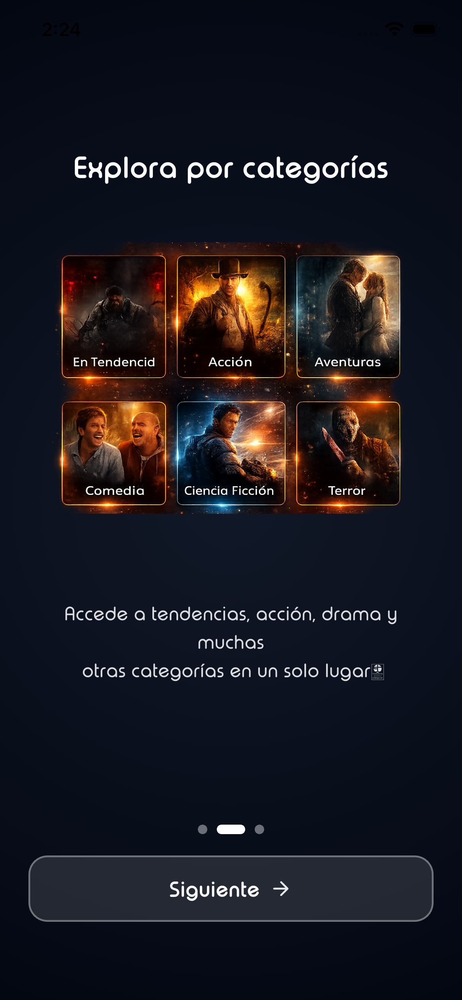
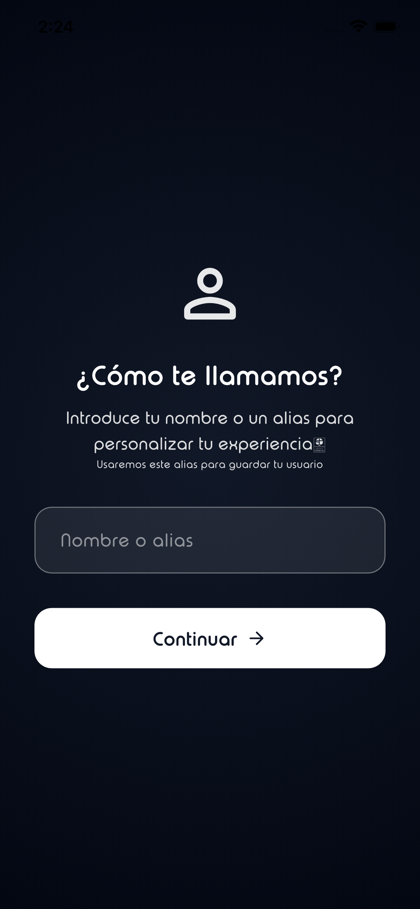
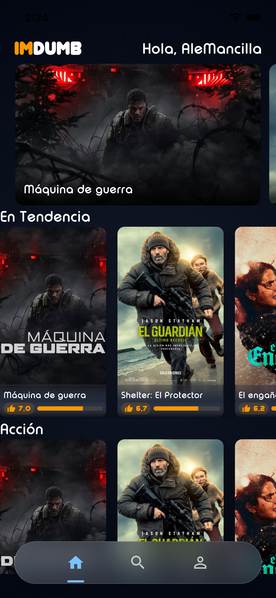
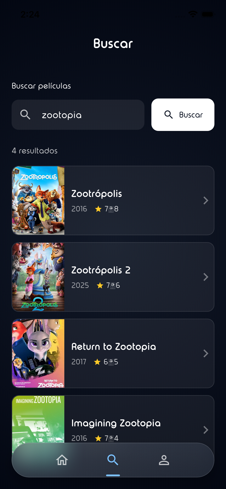
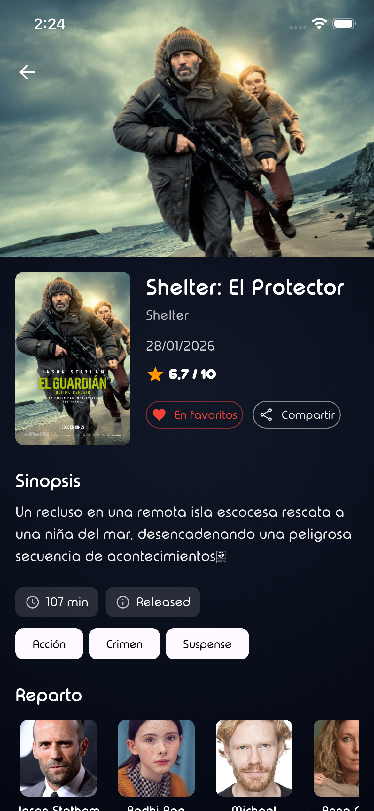
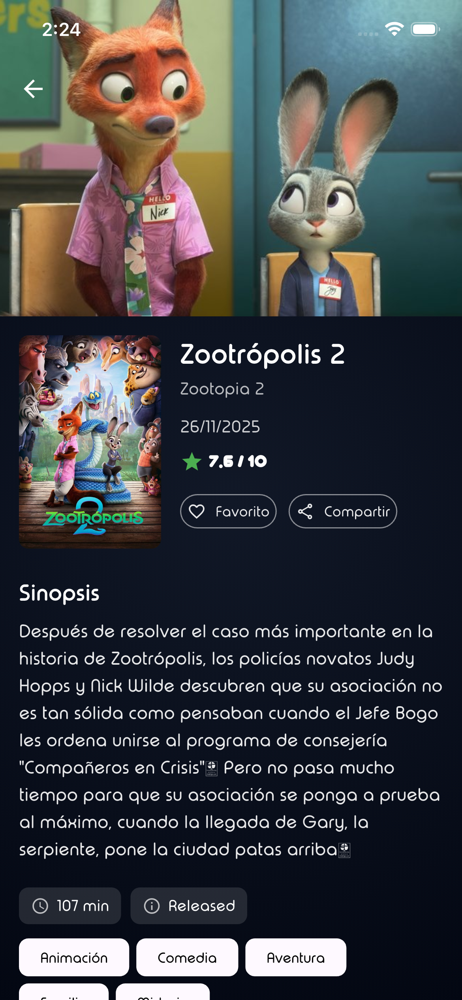
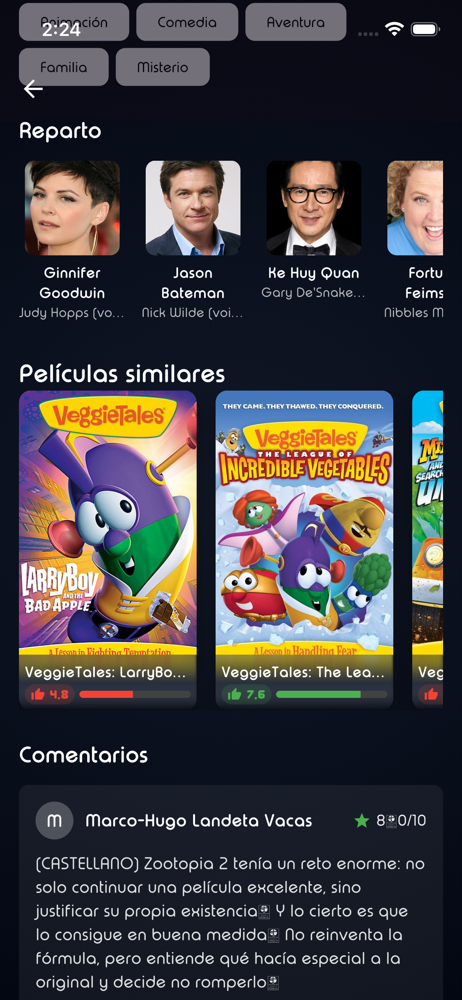
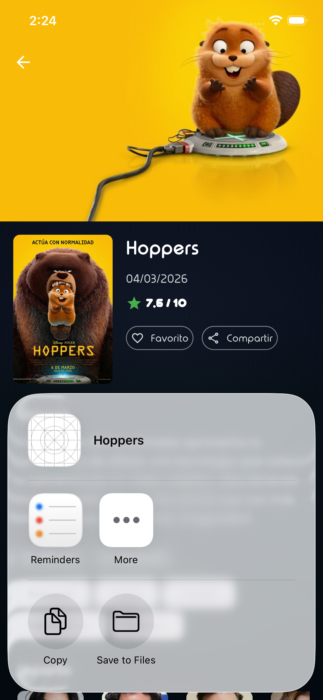
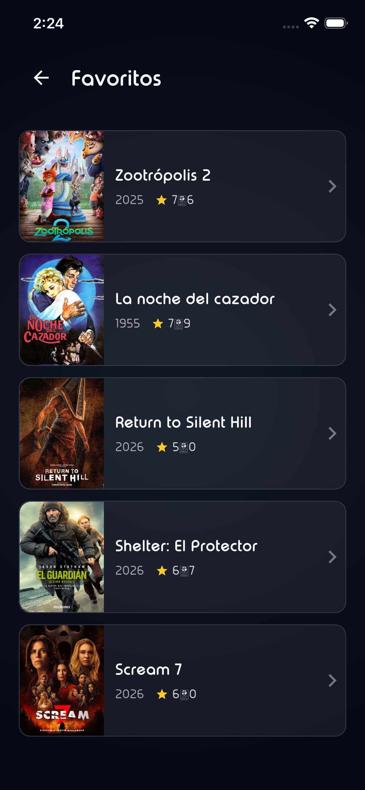

# IMDUMB - Flutter Mobile Developer Challenge

## 1. Descripción general del proyecto

**IMDUMB** es una aplicación móvil en Flutter que permite explorar películas, ver categorías, detalles, reparto, reseñas y gestionar un perfil de usuario con datos sincronizados en Firebase.

### Funcionalidades principales

| Funcionalidad | Descripción |
|---------------|-------------|
| **Splash** | Pantalla de bienvenida con animación del logo y mensaje obtenido vía Firebase Remote Config. |
| **Firebase Remote Config** | Mensaje de bienvenida configurable (`welcome_message`) sin redesplegar la app. |
| **Onboarding** | Flujo de introducción con páginas deslizables (categorías, recomendaciones, etc.). |
| **Configuración de perfil** | Pantalla para introducir nombre o alias; se guarda en Firebase Realtime Database (clave única por alias). |
| **Listado de categorías** | Géneros de películas con listas anidadas por categoría. |
| **Listas anidadas de películas** | Carrusel “En cartelera”, “En tendencia” y secciones por género. |
| **Pantalla de detalle de película** | Título, sinopsis, valoración, créditos (actores), películas similares, reseñas. |
| **Carrusel de imágenes** | Carrusel horizontal para películas en cartelera. |
| **Lista de actores** | Reparto en la pantalla de detalle. |
| **Favoritos** | Botón de favorito en el detalle; lista de favoritos en Perfil, persistida en Firebase. |
| **Búsqueda** | Búsqueda de películas por texto (API de búsqueda TMDB). |
| **Compartir** | Compartir título y sinopsis desde el detalle (share_plus). |
| **Cerrar sesión** | Opción en Perfil con confirmación; limpia sesión local y vuelve a introducir alias. |

---

## 2. Arquitectura

Se sigue **Clean Architecture** con tres capas bien delimitadas:

```
                    ┌─────────────────────────────────────┐
                    │           PRESENTATION              │
                    │  (Screens, Widgets, Providers)      │
                    └─────────────────┬───────────────────┘
                                      │
                    ┌─────────────────▼───────────────────┐
                    │             DOMAIN                  │
                    │  (Entities, Repositories, UseCases) │
                    └─────────────────┬───────────────────┘
                                      │
                    ┌─────────────────▼───────────────────┐
                    │               DATA                  │
                    │  (Models, Datasources, Mappers,     │
                    │   Repository Implementations)       │
                    └─────────────────────────────────────┘
```

- **Presentation**: UI (pantallas y widgets) y lógica de presentación; consume el dominio vía **Riverpod** (providers que usan use cases / repositorios).
- **Domain**: entidades, contratos de repositorios y casos de uso; sin dependencias de frameworks ni de datos concretos.
- **Data**: implementación de fuentes de datos (remota con Dio, local con Hive/SharedPreferences, Firebase), modelos, mappers y implementación del repositorio.

La dependencia es unidireccional: **Presentation → Domain ← Data**.


## 3. Gestión de estado (Riverpod)

- **StateNotifier**: `SplashController` mantiene `SplashState` (Loading / Ready con mensaje / Error) y se expone con `StateNotifierProvider<SplashController, SplashState>`.
- **Provider**: Para dependencias (Dio, datasources, repositorio, use cases). El repositorio depende de abstracciones (datasources) inyectadas por ref.
- **FutureProvider / FutureProvider.family**: Para datos asíncronos que la UI observa:
  - `popularMoviesProvider(page)`, `nowPlayingMoviesProvider(page)`, `moviesByGenreProvider(genreId)`, `movieDetailsProvider(movieId)`, `searchMoviesProvider(query)`, etc.
  - `favoriteIdsProvider`, `favoriteMoviesProvider` para favoritos.
- **StateProvider**: `searchQueryProvider` (texto de búsqueda), `selectedGenreIdProvider` (opcional).
- **Flujo**: La UI hace `ref.watch(provider)`; al invalidar con `ref.invalidate(provider)` se vuelve a ejecutar el futuro y la UI se actualiza (p. ej. favoritos al entrar en FavoritesScreen o al pulsar favorito en el detalle).

La solución mantiene la lógica de negocio en dominio (repositorios, use cases) y la UI solo observa providers e invalida cuando debe refrescar, alineado con buenas prácticas de arquitectura.

---

## 4. Integración con la API

- **Configuración**: `DioClient` usa `ApiConstants.baseUrl` (ej. `https://api.themoviedb.org/3`) y timeouts de 15 s. `AppDioInterceptor` añade `Authorization: Bearer ${ApiConstants.apiKey}` y headers JSON.
- **Variables de entorno**: En `.env.stage` / `.env.prod` (según `--dart-define=ENV=stage|prod`): `BASE_URL`, `BASE_IMAGE_URL`, `BASE_BACKDROP_URL`, `API_KEY`.
- **Datasource**: `MovieRemoteDatasourceImpl` recibe `Dio` por constructor; cada método hace `dio.get(ruta, queryParameters: {...})` y parsea `response.data` a modelos (listas de películas, géneros, créditos, etc.).
- **Repositorio**: `MovieRepositoryImpl` primero consulta `MovieLocalDatasource` (Hive); si hay caché devuelve entidades; si no, llama a `MovieRemoteDatasource`, guarda en Hive y devuelve entidades. Los mappers convierten modelos → entidades.
- **Flujo hasta la UI**: API → Datasource (Model) → Repository (cache + remote) → UseCase → Provider (FutureProvider) → `ref.watch` en widgets.

---

## 5. Integración con Firebase

### Firebase Remote Config

- **Uso**: En el splash, `RemoteConfigService` hace `fetchAndActivate()` y lee el valor `welcome_message`.
- **SplashController**: Tras inicializar Remote Config, actualiza el estado a `SplashReady(message)`; el mensaje se muestra en pantalla y opcionalmente se persiste en SharedPreferences.
- **Configuración**: Tiempo de fetch 10 s; intervalo mínimo 0 (desarrollo). En producción conviene aumentar el intervalo.

### Firebase Realtime Database

- **Estructura**: `users/{alias_sanitizado}` con `alias`, `createdAt` y `favorites/{movieId}` con datos de la película (id, title, posterPath, etc.) y `addedAt`.
- **Uso**:
  - **Perfil**: Al guardar alias se usa el alias (sanitizado) como clave; si ya existe el nodo no se sobrescribe (se muestra “Bienvenido de nuevo”).
  - **Favoritos**: Añadir/quitar favorito es escribir/borrar en `users/{userId}/favorites/{movieId}`. Los IDs de favoritos se leen para el corazón en el detalle y para la pantalla de favoritos (que usa GetDetailsMovie por cada ID).

---

## 6. Persistencia local

### SharedPreferences

- **Onboarding**: `OnboardingStorage.hasCompleted()` / `markCompleted()` para no mostrar onboarding de nuevo.
- **Perfil**: `ProfileStorage`: `display_name`, `firebase_user_id`, `profile_completed`; `clearSession()` para cerrar sesión.
- **Splash**: Opcionalmente el mensaje de Remote Config se guarda en prefs.

### Hive

- **Caché de películas**: Una caja (box) compartida para películas populares, now playing, por género, detalles, créditos, similares y reseñas, keyed por página o por id según el caso.
- **MovieLocalDatasourceImpl**: Implementa `MovieLocalDatasource`; lee/escribe modelos en Hive. El repositorio consulta primero local y solo pide a la API si no hay caché.

---

## 7. Principios SOLID aplicados

### Single Responsibility Principle (SRP)

- **Use cases**: Cada uno tiene una única razón de cambio (ej. `GetPopularMovies` solo obtiene películas populares).  
  Archivo: `lib/features/movies/domain/usecases/get_popular_movies.dart`
- **Repositorio**: Orquesta fuentes (remote/local) pero delega el acceso en datasources.  
  Archivo: `lib/features/movies/data/repositories/movie_repository_impl.dart`
- **Controladores**: `SplashController` solo inicializa app y Remote Config y actualiza estado de splash.

### Open/Closed Principle (OCP)

- **Datasources**: Se pueden añadir nuevas fuentes (ej. otro API o caché) implementando las interfaces `MovieRemoteDatasource` y `MovieLocalDatasource` sin modificar el repositorio.  
  Archivos: `movie_remote_datasource.dart`, `movie_local_datasource.dart`
- **Repositorio**: `MovieRepositoryImpl` recibe las implementaciones por constructor; extender comportamiento es añadir nuevas implementaciones o decoradores, no cambiar el código existente.

### Dependency Inversion Principle (DIP)

- **Dominio**: El contrato `MovieRepository` está en domain; la implementación está en data. Los use cases dependen de `MovieRepository`, no de detalles de red o Hive.  
  Archivo: `lib/features/movies/domain/repositories/movie_repository.dart`
- **Inyección**: En `movie_provider.dart`, el repositorio se construye con `ref.read(movieRemoteDatasourceProvider)` y `ref.read(movieLocalDatasourceProvider)`; los use cases reciben `ref.read(movieRepositoryProvider)`. Las abstracciones se inyectan vía Riverpod.

```dart
// Ejemplo: UseCase depende de la abstracción MovieRepository
class GetPopularMovies {
  final MovieRepository repository;
  GetPopularMovies(this.repository);
  Future<List<Movie>> call({int page = 1}) => repository.getPopularMovies(page: page);
}
```

---

## 8. Cómo ejecutar el proyecto

### Requisitos

- **Flutter**: 3.10.7 o superior (SDK ^3.10.7).
- **Dart**: 3.10.7+.

### Pasos

1. Clonar el repositorio:
   ```bash
   git clone https://github.com/AleMancilla/IMDUMB.git
   cd IMDUMB
   ```

2. Copiar y configurar variables de entorno:
   ```bash
   cp .env.example .env.stage
   # Las variables de entorno en este repositorio son publicas para que puedan clonar el repositorio y ejecutarlo sin problemas
   ```

3. Instalar dependencias:
   ```bash
   flutter pub get
   ```

4. Ejecutar (stage por defecto):
   ```bash
   flutter run --dart-define=ENV=stage
   ```
   Para producción:
   ```bash
   flutter run --dart-define=ENV=prod
   ```
   (Requiere `.env.prod` con las mismas claves.)

### Firebase

- El proyecto incluye `firebase_options.dart` y configuración en `android/` e `ios/` (google-services, GoogleService-Info).
- **Remote Config**: En la consola de Firebase, crear el parámetro `welcome_message` (string).
- **Realtime Database**: Activar Realtime Database y definir reglas (en desarrollo se puede permitir read/write en `users`). La app guarda usuarios por alias y favoritos bajo `users/{alias}/favorites`.

---

## 9. Endpoints de la API

Base: `https://api.themoviedb.org/3` (configurable por .env).

| Método | Ruta | Uso |
|--------|------|-----|
| GET | `/movie/popular` | Películas populares (paginado). |
| GET | `/movie/now_playing` | Películas en cartelera. |
| GET | `/genre/movie/list` | Lista de géneros. |
| GET | `/discover/movie` | Películas por género (`with_genres`). |
| GET | `/search/movie` | Búsqueda por `query`. |
| GET | `/movie/{id}` | Detalle de película. |
| GET | `/movie/{id}/credits` | Reparto y equipo. |
| GET | `/movie/{id}/similar` | Películas similares. |
| GET | `/movie/{id}/reviews` | Reseñas. |

Parámetros comunes: `language=es-ES`, `page` cuando aplica. Autenticación: `Authorization: Bearer <API_KEY>`.

---

## 10. Capturas de pantalla

### Splash


### Onboarding
| Paso 1 | Paso 2 | Paso 3 |
|--------|--------|--------|
|  |  |  |

### Configuración de perfil (alias)


### Home


### Búsqueda


### Detalle de película
| Vista general | Similares / Compartir |
|---------------|------------------------|
|  |  |
|  |  |

### Perfil y Favoritos
| Perfil | Favoritos |
|--------|-----------|
|  |  |

---

## 11. Consideraciones de rendimiento

- **Caché con Hive**: Menos llamadas a la API; datos de listados y detalle reutilizados desde local.
- **Listas**: Uso de `ListView.builder` / listas horizontales con ítems acotados (p. ej. `MovieCard`, `SearchMovieCard`) para no construir todos los hijos a la vez.
- **Imágenes**: `cached_network_image` para pósters y backdrops.
- **Providers**: `FutureProvider.family` evita cargar datos de más (solo se pide la página o id que la UI necesita); invalidación selectiva (favoritos, búsqueda) para refrescos controlados.
- **Favoritos**: La pantalla de favoritos invalida el provider al entrar y al cambiar favorito en el detalle, equilibrando actualización y reutilización de caché.

---

# Credits
<section style="display:flex;justify-content:space-around;align-items:center;">
<a href="https://www.themoviedb.org/" target="_blank"></a>
